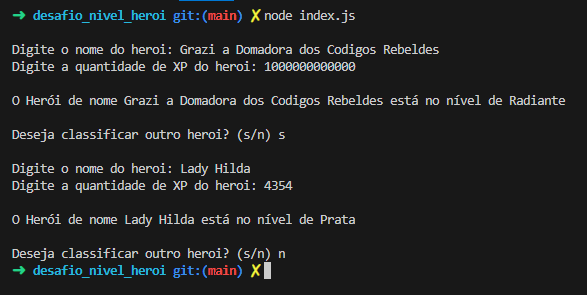
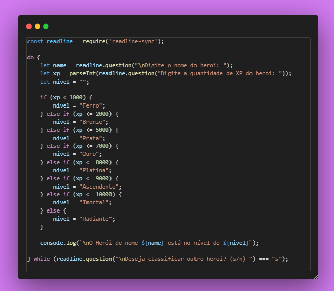
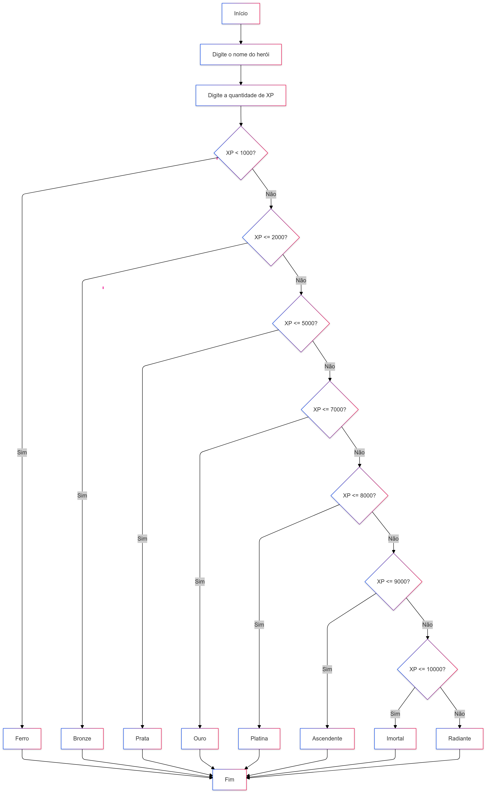

# 🦸‍♂️ Classificação de Heróis 🦸‍♀️

Este projeto classifica heróis com base na quantidade de experiência (XP) que eles possuem. Dependendo da quantidade de XP, o herói será classificado em diferentes níveis, como Ferro, Bronze, Prata, etc.

## 🛠️ Tecnologias Utilizadas

- **Node.js**: Ambiente de execução JavaScript server-side.
- **readline-sync**: Biblioteca para capturar entrada do usuário via terminal.

## 📊 Estrutura de Decisão

- XP < 1.000: 🪨 Ferro
- 1.001 <= XP <= 2.000: 🥉 Bronze
- 2.001 <= XP <= 5.000: 🥈 Prata
- 5.001 <= XP <= 7.000: 🥇 Ouro
- 7.001 <= XP <= 8.000: 💎 Platina
- 8.001 <= XP <= 9.000: 🚀 Ascendente
- 9.001 <= XP <= 10.000: 🛡️ Imortal
- XP >= 10.001: 🌟 Radiante

## 📝 Saída

Ao final, o programa exibe uma mensagem:
"O Herói de nome **{nome}** está no nível de **{nivel}**"

## 📦 Instalação

1. Clone o repositório:

   ```sh
   git clone https://github.com/GrazielleNascimento/desafio-nivel-heroi-dio
   
   ```

2. Navegue até o diretório do projeto:

    ```sh
    cd desafio-nivel-heroi-dio
    ```

3. Instale as dependências

     ```sh
    npm install
    ```


## 🚀 Execução

Para executar o projeto, use o comando:

    ```sh
node index.js
    ```

## 💻 Exemplo de Execução



## 👩‍💻 Código



## 📊 Fluxograma do Projeto




